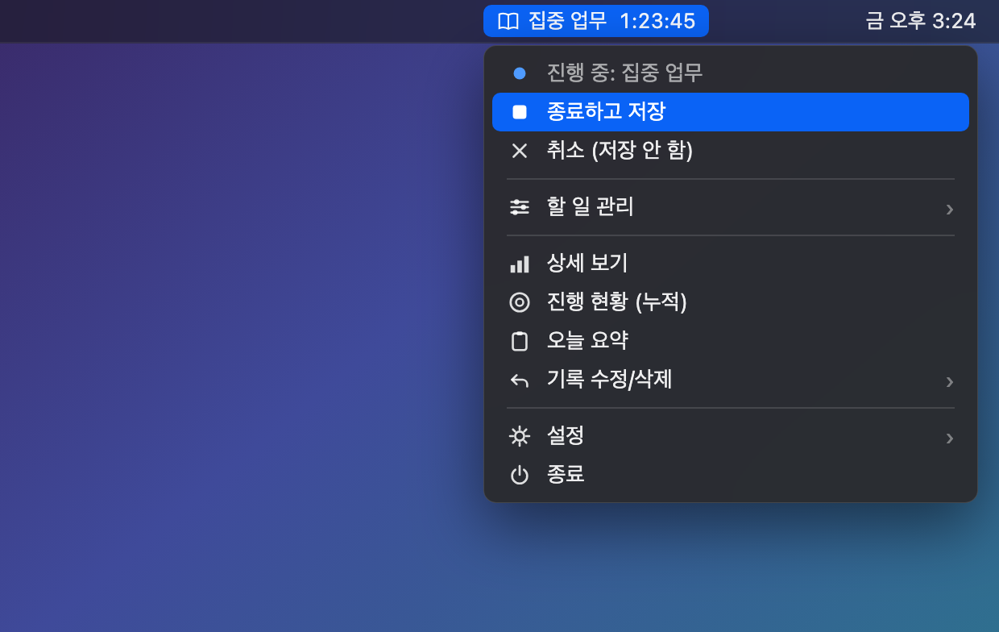
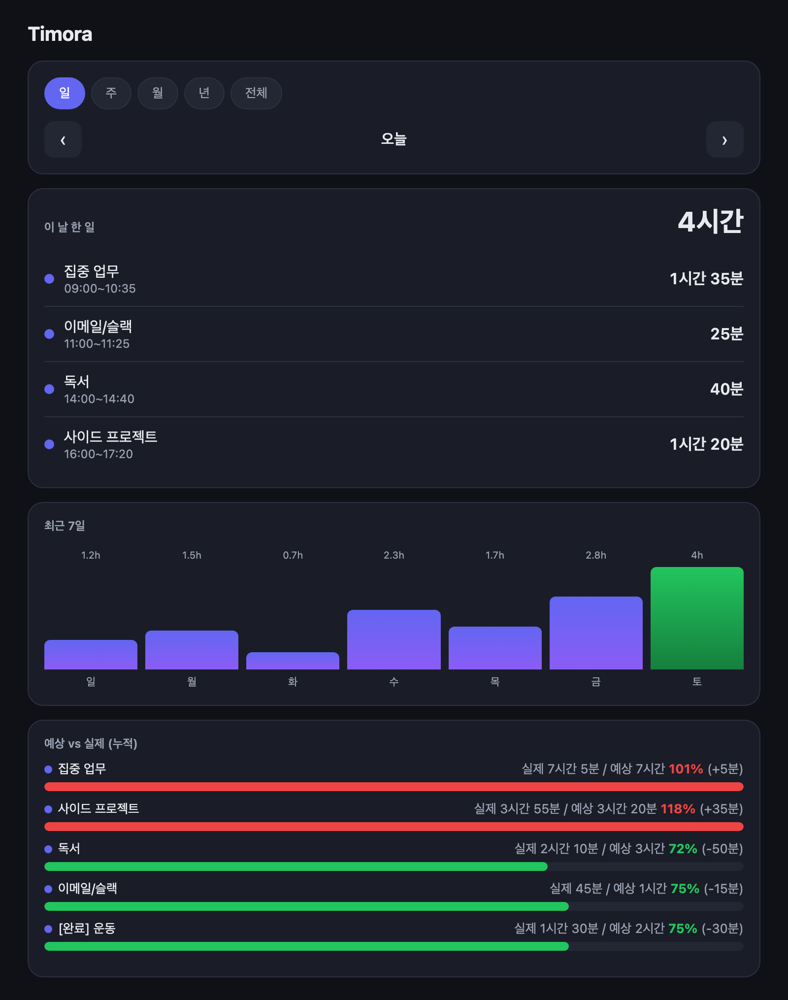

# Timora

[](https://github.com/gjsk132/timora/releases/latest)
[](https://github.com/gjsk132/timora/releases)
[](LICENSE)


[English](README.md) · **한국어**

macOS 메뉴바에서 돌아가는 시간 기록 앱입니다. 할 일을 등록해두고 시작/정지로
시간을 재고, 날짜·주·월·년 단위 통계와 그래프, 예상 대비 실제 시간을 볼 수 있어요.

인터페이스는 **한국어와 영어**를 지원하며, 앱 안의 **설정 → 언어**에서 언제든
바꿀 수 있어요.

> macOS 전용입니다. (윈도우에서는 동작하지 않아요.)

## 스크린샷

<p align="center">
  
</p>

<p align="center"><em>메뉴바에 상주 — 진행 시간이 메뉴바에서 바로 흐르고, 시작/정지와 설정이 클릭 한 번 거리에 있어요.</em></p>

<p align="center">
  
</p>

<p align="center"><em>상세 보기 — 하루 기록, 추이 그래프, 예상 대비 실제.</em></p>

## 다운로드

**[⬇︎ 최신 릴리스 받기](https://github.com/gjsk132/timora/releases/latest)** — `Timora-<버전>.zip` 을 받으세요.

## 설치 방법

### 방법 A — 릴리스에서 받기 (추천)

1. [최신 릴리스](https://github.com/gjsk132/timora/releases/latest)에서
   **`Timora-<버전>.zip`** 을 받아 원하는 곳(홈·문서 폴더 추천)에 압축을 풉니다.
2. 압축을 푼 `timora` 폴더에서 **`install.command`** 를 더블클릭합니다.
   - "확인되지 않은 개발자" 경고가 뜨면: **우클릭 → 열기 → 열기** 를 누르세요.
3. 터미널 창이 열리고 자동으로 설치됩니다. (1~2분)
   - `python3 not found` 라고 나오면, 터미널에 `xcode-select --install` 을 실행한 뒤
     다시 `install.command` 를 더블클릭하세요.
4. "Done!" 이 뜨면 끝!

### 방법 B — 소스에서

```bash
git clone git@github.com:gjsk132/timora.git
cd timora
./install.command
```

## 실행 방법

- **`Timora.app`** 을 더블클릭하면 메뉴바에 책 아이콘이 생깁니다.
- 아이콘을 클릭해 할 일을 등록하고 시작/정지하면 됩니다.
- 자주 쓰려면 `Timora.app` 을 Dock이나 응용 프로그램 폴더로 옮겨두세요.

## 설정

메뉴바 아이콘 → **설정**:

- **언어** — English / 한국어
- **알림** — 알림 켜기/끄기
- **자리 비움 감지** — 기록 중 자리를 비우면 알려줌
- **자리 비움 기준** — 5 / 15 / 30 / 60분
- **데이터 폴더 열기** — 백업용으로 `data.json` 을 Finder에서 보여줌

## 프로젝트 구조

```
Timora.app/        macOS 앱 번들 (timora 패키지를 실행)
install.command    원클릭 설치: venv 생성 + 의존성 설치
release.sh         관리자용: 태그·zip 빌드·GitHub 릴리스 게시
requirements.txt   파이썬 의존성 (rumps, pyobjc)
timora/            애플리케이션 패키지
├── __main__.py    진입점 (python -m timora)
├── config.py      경로·상수
├── i18n.py        번역 (한국어 / 영어)
├── formatting.py  시간 포맷·파싱 헬퍼
├── storage.py     Store: 데이터 로드/저장/집계
├── assets.py      앱 아이콘·SF Symbol·번들 식별자
├── notifications.py
├── menu.py        메뉴아이템 헬퍼
├── system.py      자리 비움 감지
├── instance.py    중복 실행 방지
├── dialogs.py     AppKit 입력 다이얼로그
├── report.py      상세보기 HTML
└── app.py         Tracker (rumps.App) 컨트롤러
```

## 참고

- 기록은 이 폴더의 `data.json` 에 저장됩니다. (자동 생성)
- 폴더를 통째로 백업하면 기록도 함께 보관돼요.

## 요구 사항

- macOS 10.13 이상
- Python 3 (Xcode Command Line Tools에 포함: `xcode-select --install`)
