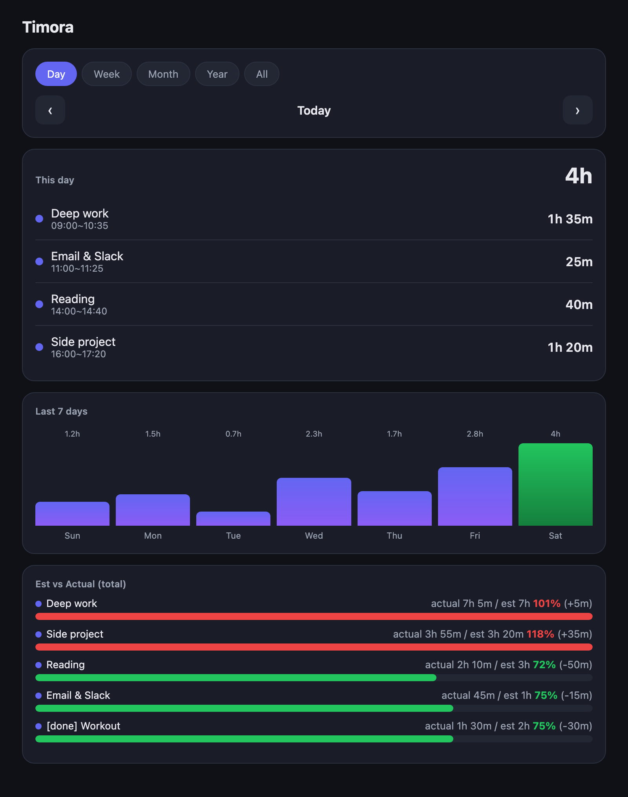

# Timora

[](https://github.com/gjsk132/timora/releases/latest)
[](https://github.com/gjsk132/timora/releases)
[](LICENSE)


**English** · [한국어](README.ko.md)

A native macOS menu bar time tracker. Register your tasks, start/stop a timer
to record how long each one takes, and view totals, per-task estimates, and
charts by day / week / month / year.

The interface is available in **English and Korean** — switch anytime from
**Settings → Language** inside the app.

> macOS only. (It does not run on Windows.)

## Screenshots

<p align="center">
  
</p>

<p align="center"><em>Detailed view — daily log, trend chart, and estimate vs. actual.</em></p>

## Download

**[⬇︎ Get the latest release](https://github.com/gjsk132/timora/releases/latest)** — grab `Timora-<version>.zip`.

## Install

### Option A — From the release (recommended)

1. Download **`Timora-<version>.zip`** from the
   [latest release](https://github.com/gjsk132/timora/releases/latest) and unzip it
   somewhere convenient (your Home or Documents folder works well).
2. Open the unzipped `timora` folder and double-click **`install.command`**.
   - If macOS says "unidentified developer": **right-click → Open → Open**.
3. A Terminal window installs everything automatically (1–2 min).
   - If it says `python3 not found`, run `xcode-select --install` in Terminal,
     then double-click `install.command` again.
4. When you see "Done!", you're set.

### Option B — From source

```bash
git clone git@github.com:gjsk132/timora.git
cd timora
./install.command
```

## Run

- Double-click **`Timora.app`**. A book icon appears in the menu bar.
- Click the icon to add tasks and start/stop timing.
- For quick access, move `Timora.app` to your Dock or Applications folder.

## Settings

Open the menu bar icon → **Settings**:

- **Language** — English / 한국어
- **Notifications** — turn notifications on/off
- **Away detection** — get reminded when you leave your desk while recording
- **Away threshold** — 5 / 15 / 30 / 60 minutes
- **Open data folder** — reveal `data.json` in Finder for backup

## Project layout

```
Timora.app/        macOS app bundle (launches the timora package)
install.command    one-click setup: creates venv + installs deps
release.sh         maintainer tool: tag, build zip, publish a GitHub release
requirements.txt   Python dependencies (rumps, pyobjc)
timora/            application package
├── __main__.py    entry point (python -m timora)
├── config.py      paths and constants
├── i18n.py        translations (English / Korean)
├── formatting.py  time formatting / parsing helpers
├── storage.py     Store: load / save / aggregate the database
├── assets.py      app icon, SF Symbols, bundle identifier
├── notifications.py
├── menu.py        menu item helper
├── system.py      idle detection
├── instance.py    single-instance lock
├── dialogs.py     AppKit input dialogs
├── report.py      detailed-view HTML
└── app.py         Tracker (rumps.App) controller
```

## Notes

- Your records are stored in `data.json` in this folder (created automatically).
- Back up the folder to keep your records.

## Requirements

- macOS 10.13+
- Python 3 (comes with Xcode Command Line Tools: `xcode-select --install`)
